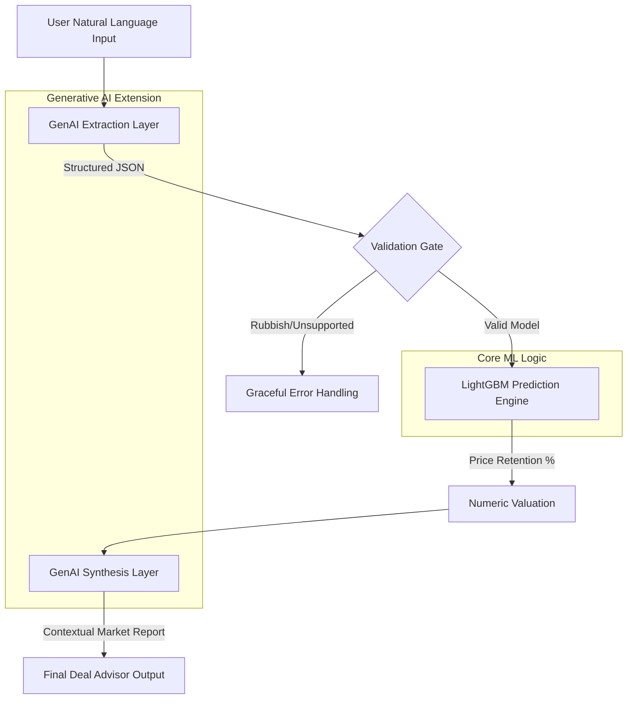

# AUS Preowned Car Price Estimator & Deal Advisor Report

This project has 2 primary functions : 

1. Predict preowned car prices using a **retention-based model** on AUS car data (2023-2024) 

2. A decision-support application that combines the prediction with **Gen AI–powered explanations**, designed to help buyers evaluate whether a used car listing is fairly priced.

This project separates **deterministic pricing logic** from **LLM-based reasoning**, with guardrails to prevent hallucinations and misleading advice.

---
## 🎯 Problem Statement

Buyers of pre-owned cars often face:
- Incomplete or messy listings
- Emotionally based seller prices
- Tools that provide a number but no explanation

While some solutions predict price, there is no context or research to support decisions

**This project aims to bridge that gap.**
---

## Why not just ML prediction?

Predicted price alone does not answer:
- If the listing is *overpriced or justified*?
- What factors matter for *this specific brand & model*?
- What are the *industry standard parameters* to be considered for a fair evaluation?

This is where an LLM layer translates numeric outputs into contextual, grounded reasoning —
without being allowed to invent facts.


# 1. Deal Advisor (Gen AI Powered)

## 🧠 Approach

1. **Predict a fair market price** for a used car using a trained ML model  
2. **Explain the price** in clear, buyer-friendly language  
3. **Compare listed vs predicted price** and classify the deal quality  
4. **Ground explanations in curated market sources**, instead of an LLM guesswork  
5. **Handle incomplete or unrealistic inputs gracefully** via conversational nudges  

---

## 🧩 System Flow & High-Level Architecture


The system is structured into four layers:

### 1️⃣ ML Pricing Layer (Deterministic)
- Trained LightGBM model
- Inputs: age, mileage (log-transformed), brand, model, interactions
- Output: predicted price via implied retention × new price proxy
- **No GenAI involvement**

### 2️⃣ Market Knowledge Layer (Controlled Evidence)
- `curated_market_sources.json` short, LLM generated summaries reviewed by human
- Sources include automotive websites discussing:
  - Resale value
  - Reliability
  - Maintenance
  - Depreciation
- Each entry includes an explicit source name
- **No live browsing or dynamic retrieval**

### 3️⃣ LLM Reasoning Layer (Generative AI)
- Uses an LLM strictly for:
  - Extracting structured fields from unstructured listings
  - Explaining pricing gaps in natural language
- Receives **facts + curated evidence**
- Explicitly prohibited from:
  - Inventing facts
  - Introducing new sources
  - Altering numeric outputs

### 4️⃣ Conversation & Guardrails Layer
- Conversational input via Streamlit
- Missing-field nudging (ask only for what’s missing)
- Plausibility checks (e.g., unrealistic price/year combinations)
- Allows **field-level corrections** instead of full re-entry

---

## ✨ Key Features

- 📊 **ML-based price prediction** (not LLM-generated)
- 💬 **Conversational extraction** from messy listings
- 🧠 **LLM-generated explanations** grounded in evidence
- 🧾 **Inline source citations** from known automotive sites
- ⚠️ **Sanity checks** with smart pushback on unrealistic inputs
- 🔁 **Partial correction flow** (fix one field at a time)

---

## 🛡️ Hallucination Prevention Strategy

This project is intentionally designed to **limit LLM freedom**:

- No web browsing
- No open-ended fact generation
- Market context injected as fixed text
- Instructions enforce:
  - Use only provided sources
  - Cite sources inline
  - Avoid absolute claims

The LLM is used for **reasoning over facts**, not for predicting numbers or generating facts.

---

## 🧪 Example User Flow

1. User pastes a listing: *Honda CR-V 2020, 60,000 km, listed at $35,000*
2. System extracts structured fields
3. ML model predicts a fair price
4. LLM explains:
- Whether the listed price makes sense
- How it compares to predicted price
- What the buyer should do next
5. Explanation cites relevant market sources


## 🗂️ Repository Structure

.
├── streamlit_app.py <br>
├── models/ <br>
│ ├── final_price_pipe.joblib <br>
│ ├── new_price_lookup_bm.csv <br>
│ ├── new_price_lookup_b.csv <br>
├── data/ <br>
│ └── curated_market_sources.json <br>
├── README.md <br>

## ▶️ How to Run Locally

```bash
pip install -r requirements.txt
export OPENAI_API_KEY=your_key_here
streamlit run streamlit_app.py
```

## 🧑‍💼 Why This Project Matters

This project demonstrates:

- Responsible, production-style use of Generative AI
- Clear separation of ML prediction and LLM reasoning
- Explicit hallucination controls
- Thoughtful conversational UX for high-trust decisions
- It is designed not as a demo chatbot, but as a realistic decision-support system

## 📄 Disclaimer

This project is for educational and demonstration purposes only.
It does not provide financial or legal advice.


## Future Improvements

- Brand/model-level embedding search over market sources
- Confidence scoring on explanations
- Region-specific pricing adjustments
- Automated source refresh with human review

# 2. Price Estimator (ML Based)

Estimate the **retained price (New price - Depreciation)** per Brand/Model as a function of kilometres, age and vehicle attributes 

## Repo Structure
- `src/` training + feature pipeline
- `models/` saved model + lookup tables
- `streamlit_app.py` Streamlit UI

## Setup (Local)
```bash
python -m venv .venv
# Windows:
.venv\Scripts\activate
# Mac/Linux:
source .venv/bin/activate

pip install -r requirements.txt

```
## ✅ LightGBM Model Performance (5-Fold GroupKFold CV)

Evaluation done using **GroupKFold** split by **Brand + Model** to reduce leakage.

**Cross-validation results (Price prediction):** 
- **MAPE:** ~ 24%  
- **R²:** ~ 0.64  

✅ The model's **R²** indicates a baseline performance for a marketplace with noise due to
- Vehicle Condition: Scratches, interior wear and tear
- Service History: A full logbook vs. no records
- Modifications: Aftermarket wheels, bull bars, or tinted windows
- Geography: A car in Sydney might sell differently than one in Perth

## 📸 Screenshots

### Sample Prediction Validation (Actual vs Predicted)
